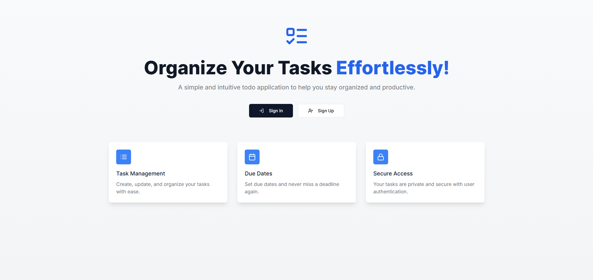

<div align="center">
  <br />
    <a href="https://to-do-application-next-js-five.vercel.app/" target="_blank">
      
    </a>
  <br />

  <br />
  <div>
    
    
    
    
    
    
  </div>

  <h1 align="center">ToDo Application</h1>

   <div align="center">
     A fully responsive Todo Application built with Next.js, NextAuth.js, Prisma, and MongoDB. This app allows users to securely sign up and log in, manage their tasks with full CRUD (Create, Read, Update, Delete) functionality, and enjoy a seamless experience across all screen sizes. Styled with Tailwind CSS for a modern and user-friendly interface. Perfect for staying organized and productive! 🚀
    </div>
</div>

## 📋 <a name="table">Table of Contents</a>

1. 🤖 [Introduction](#introduction)
2. ⚙️ [Tech Stack](#tech-stack)
3. 🔋 [Features](#features)
4. 🤸 [Quick Start](#quick-start)
5. 🚀 [Usage](#usage)
6. ✨ [Contributing](#contributing)

## <a name="introduction">🤖 Introduction</a>

This is a modern and responsive Todo Application designed to help users efficiently manage their tasks. Built with Next.js and styled with Tailwind CSS, the app provides a clean and intuitive user interface. With secure authentication powered by NextAuth.js, users can sign up and log in to access their personalized task lists. The app features full CRUD (Create, Read, Update, Delete) functionality, allowing users to seamlessly create new tasks, view their list of tasks, update existing ones, and delete tasks they no longer need. Data is persisted using Prisma and MongoDB, ensuring that users' tasks are safely stored and easily accessible across devices. Whether on a desktop or mobile device, Todoify-Nextjs offers a consistent and user-friendly experience. This project is perfect for anyone looking to stay organized and productive while exploring the power of Next.js, NextAuth.js, Prisma, and MongoDB.

## <a name="tech-stack">⚙️ Tech Stack</a>

- Next JS
- React JS
- TypeScript
- Tailwind CSS
- MongoDB
- NextAuth JS
- Prisma

## <a name="features">🔋 Features</a>

- 🔐 **User Authentication**: Sign up and log in securely using NextAuth.js.
- ✅ **Task Management**: Create, read, update, and delete tasks with ease.
- 💾 **Data Persistence**: Tasks are stored in MongoDB using Prisma ORM.
- 📱 **Responsive Design**: Fully responsive UI that works seamlessly on all devices.
- 🎨 **Modern Styling**: Styled with Tailwind CSS for a clean and intuitive user interface.

## <a name="quick-start">🤸 Quick Start</a>

Follow these steps to set up the project locally on your machine.

**1. Clone the repo:**

```bash
git clone https://github.com/MenathNDGD/ToDo-Application-NextJS.git
```

**2. Navigate to the project directory:**

```bash
cd ToDo-Application-NextJS
```

**3. Install dependencies:**

```bash
npm install
```

**4. Set up environment variables:**

- Create a `.env.local` file in the root directory and add the following:

```bash
DATABASE_URL=Your_MongoDB_URI
NEXTAUTH_URL=http://localhost:3000
NEXTAUTH_SECRET=b698RltlTIK6X/HL2GPaWjrocl8/gAmy9FGT48hHL/05CiEb05ALJAY63yo=
```

- Your MongoDB URI should be formatted as below:

```bash
DATABASE_URL=mongodb+srv://<username>:<password>@cluster0.mongodb.net/<database_name>?retryWrites=true&w=majority
```

**5. Set up Prisma:**

```bash
npx prisma db push
```

**6. Start the development server:**

```bash
npm run dev
```

Open [http://localhost:3000](http://localhost:3000) in your browser to view the project.

## <a name="usage">🚀 Usage</a>

- Sign up or log in to your account.
- Create new tasks by entering the task details.
- View all tasks on your dashboard.
- Update tasks as needed.
- Delete tasks you no longer need.

## <a name="contributing">✨ Contributing</a>

- **Contributions:** Contributions are welcome! Feel free to fork the repository, make changes, and submit a pull request.

**1. Fork the repo.**

**2. Create a new branch:**

```bash
git checkout -b feature-name
```

**3. Make your changes.**

**4. Commit your changes:**

```bash
git commit -m 'Add some feature'
```

**5. Push to the branch:**

```bash
git push origin feature-name
```

**6. Open a Pull Request.**

**Feel free to tailor these contents according to your specific preferences or any additional details you want to include!**

- **Feedback:** If you have any feedback or suggestions, I would love to hear from you. Reach out via the contact form on the portfolio or open an issue on GitHub.

- **Live Demo:** [View the live version of the project](https://to-do-application-next-js-five.vercel.app/) to see it in action!
